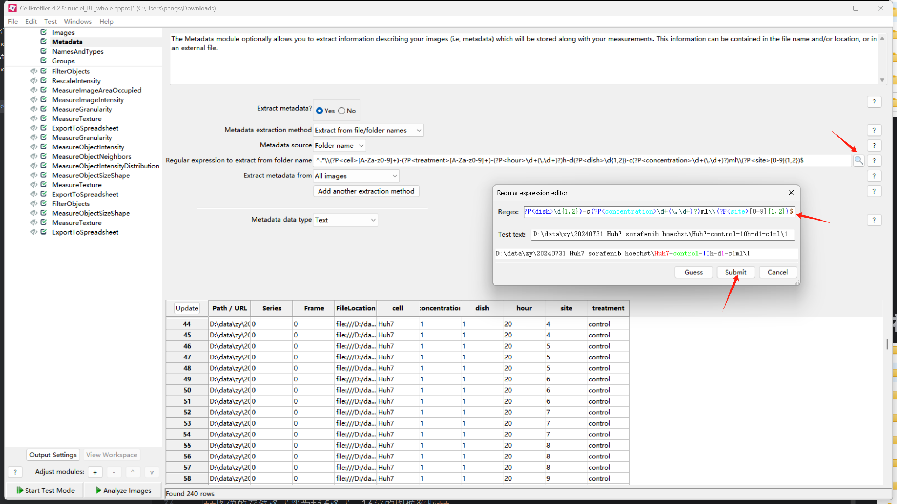

# 输入图像数据命名规范

## 1.实验干扰组命名


* 如上图所示，干扰组文件夹命名名称 `{Metadata_cell}-{Metadata_treatment}-{Metadata_hour}-d{Metadata_dish}-c{Metadata_concentration}`，其中各自定义如下
    - `Metadata_cell` 表示细胞系，用字符表示
    - `Metadata_treatment` 表示实验组干扰，用字符表示
    - `Metadata_hour` 表示实验时间，用数字表示
    - `Metadata_dish` 表示不同皿，用数字表示
    - `Metadata_concentration` 表示对应的浓度，默认单位是`ml`
## 2.视野site命名


* 如上图所示，在干扰组文件夹下，按照数字组成不同视野的图像集，名称为 `{Metadata_site}` ，值必须为整数数字类型。

## 3.图像文件命名


* 如上图所示，图像命名需要符合一定规范。在不同视野的图像集下，可以存在不同类型的图像，可以是
    - `DD、DA、AA` FRET三通道图像
    - `Mit` 线粒体图像
    - `BF_1` 明场图像，后面数字表示可以拍摄多张图像，如`BF_2`、`BF_3`
    - `Hoechst` 细胞核图像

**图像的存储格式都为tif格式，16位的图像数据**

## 4. 正则匹配公式
可以用于CellProfiler或者Python程序进行数据读取，所有参数需要添加前缀 `Metadata_`，如`Metadata_cell`。
具体正则匹配公式如下：
```cmd
^.*\\(?P<cell>[A-Za-z0-9]+)-(?P<treatment>[A-Za-z0-9]+)-(?P<hour>\d+(\.\d+)?)h-d(?P<dish>\d{1,2})-c(?P<concentration>\d+(\.\d+)?)ml\\(?P<site>[0-9]{1,2})$
```

## 5. 代码展示
## 5.1 Cellprofiler 匹配


具体流程为：
* 点击启用元数据记录
* 添加正则匹配规则
* 提交submit

## 5.2 Python 代码批处理
```python

import os
import re
import pandas as pd
from batch.file import list_immediate_subdirectories, list_numeric_subdirectories, have_target_image


def parse_batch_dir_string(input_string):
    """
    从给定的字符串中解析出 cell, treatment 和 hour 的值。
    支持小时部分为整数或浮点数。

    :param input_string: 输入字符串，格式为 'Cell-Treatment-Hour-d(Dish)-c(Concentration)ml'
    :return: 包含 cell, treatment 和 hour 、dish、concentration键值对的字典
    """
    # 定义正则表达式模式，支持浮点数
    pattern = r'^(?P<cell>[A-Za-z0-9]+)-(?P<treatment>[A-Za-z0-9]+)-(?P<hour>\d+(\.\d+)?)h-d(?P<dish>\d{1,2})-c(?P<concentration>\d+(\.\d+)?)ml$'

    match = re.match(pattern, input_string)

    if match:
        result = match.groupdict()
        # 将 hour 中的 'h' 去掉并转换为浮点数
        result['Metadata_hour'] = float(result['Metadata_hour']) if result['Metadata_hour'] else None
        result['Metadata_dish'] = int(result['Metadata_dish']) if result['Metadata_dish'] else None
        result['Metadata_concentration'] = float(result['Metadata_concentration']) if result['Metadata_concentration'] else None
        return result
    else:
        raise ValueError(f"输入字符串 '{input_string}' 不符合预期格式。")

class BatchProcessing:
    """
    批处理流程
    """
    def __init__(self, root):
        # 单个批次文件路径
        self.root = root
        self.batch_dir_list = []
        self.current_Metadata_cell = ''
        self.current_Metadata_site = ''
        self.current_Metadata_hour = 0
        self.current_Metadata_treatment = ''
        self.current_Metadata_dish = 0
        self.current_Metadata_concentration = 0
        self.current_image_set_path = ''
        # 最后的批文件
        self.current_batch_data_df = pd.DataFrame()

    def start(self, process_function, *args, **kwargs):
        """
        开始函数
        """
        self.batch_dir_list = list_immediate_subdirectories(self.root)
        # 遍历同个实验下不同批次文件
        for batch_dir in self.batch_dir_list:
            Metadata = parse_batch_dir_string(batch_dir)
            self.current_Metadata_cell = Metadata['Metadata_cell']
            self.current_Metadata_hour = Metadata['Metadata_hour']
            self.current_Metadata_treatment = Metadata['Metadata_treatment']
            # 获取文件夹下所有的视野文件夹列表
            batch_dir_path = str(os.path.join(self.root, batch_dir))
            batch_site_dir_list = list_numeric_subdirectories(batch_dir_path)
            # 遍历批次文件夹下的不同视野文件
            for batch_site_dir in batch_site_dir_list:
                site_dir_path = str(os.path.join(batch_dir_path, batch_site_dir))
                # 验证文件完整性
                self.current_Metadata_site = int(batch_site_dir)
                # 开始业务处理
                process_function(site_dir_path, *args, **kwargs)
```

